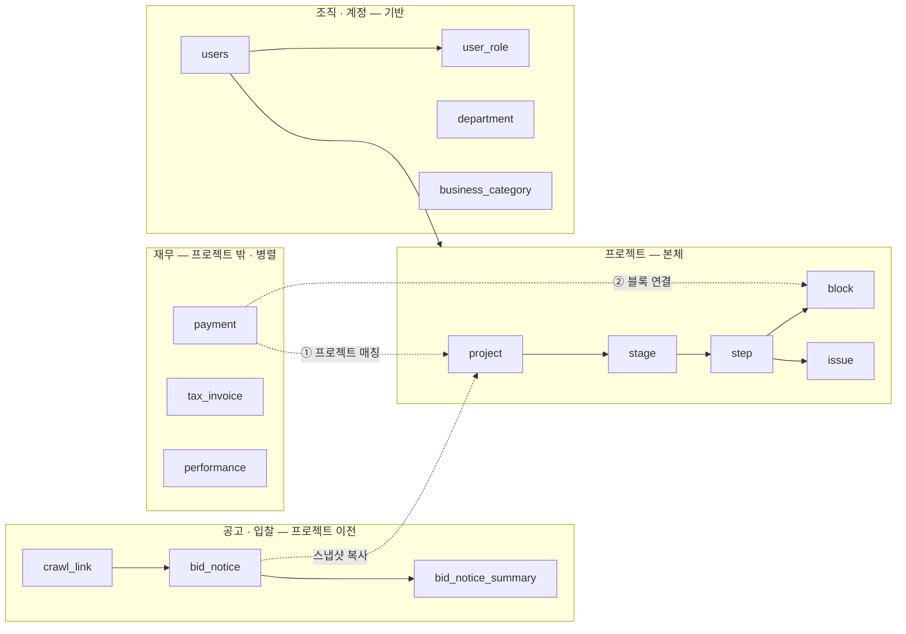
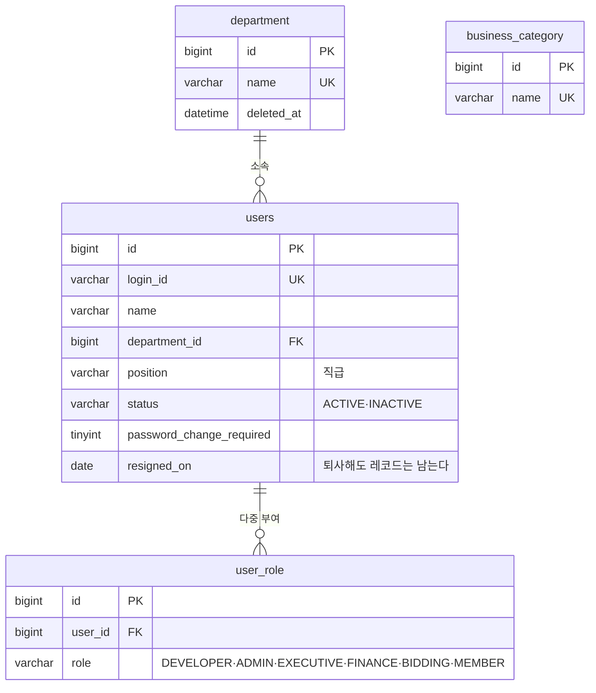
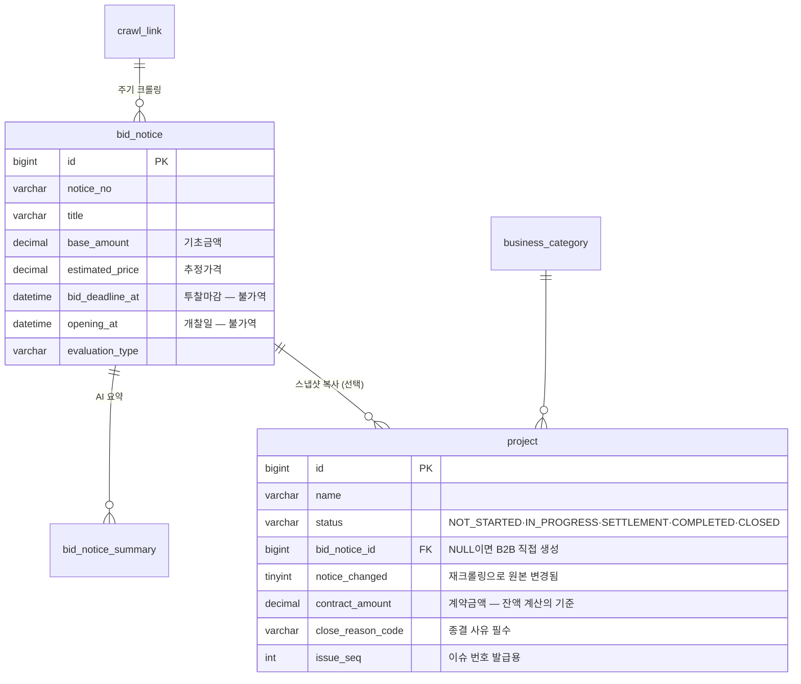
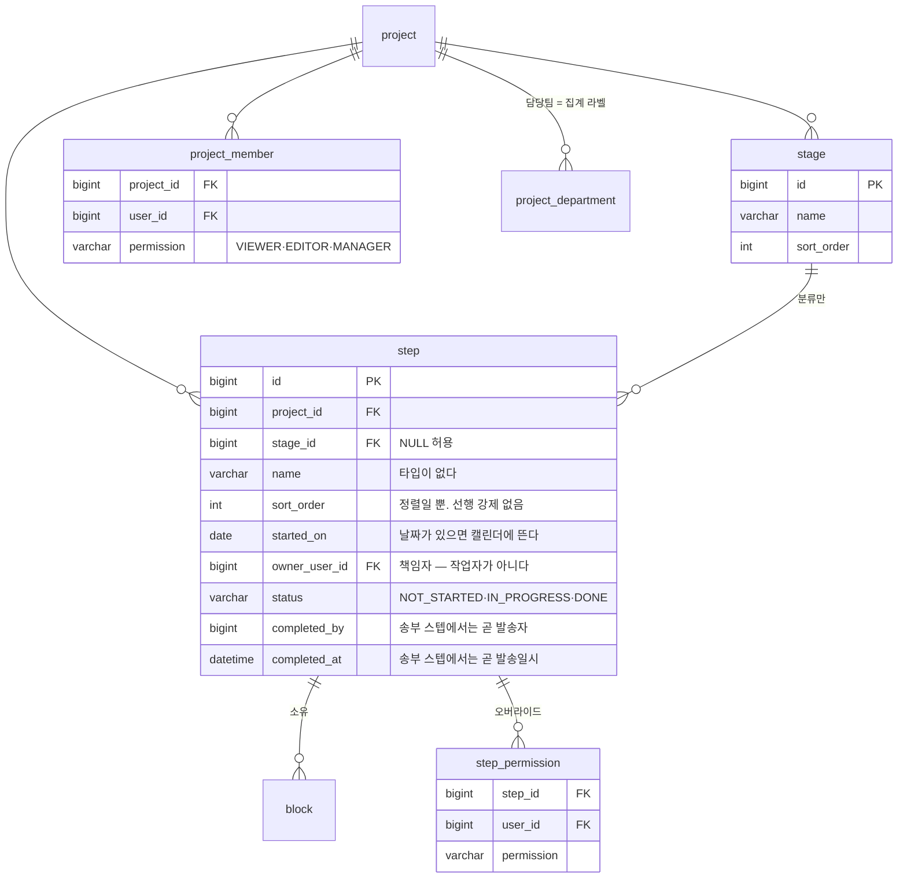
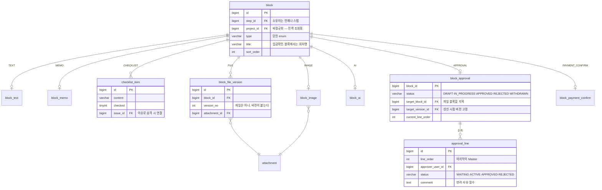
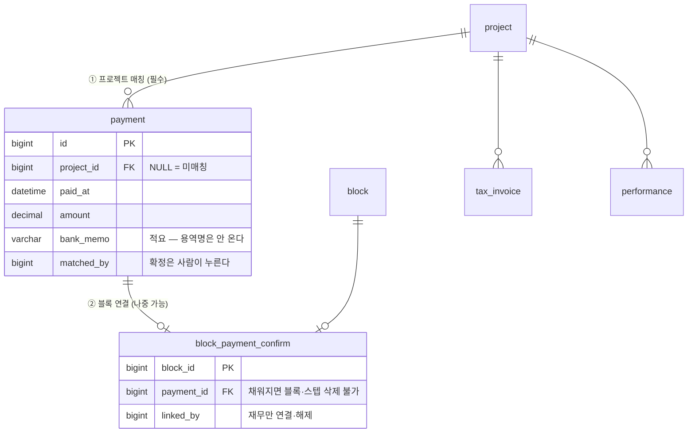
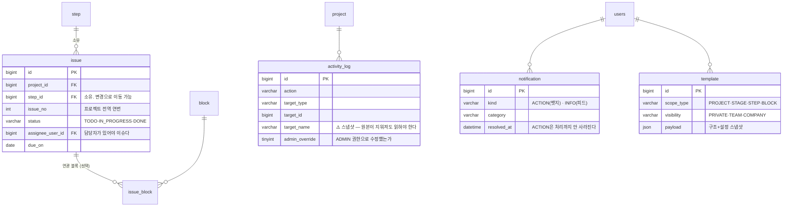

# 🗂️ ERD — 핵심 도메인

**최종 업데이트**: 2026-07-31 (초안)
**근거**: [`DOMAIN.md`](DOMAIN.md) · 실제 DDL 은 `src/main/resources/db/migration/V202607311200__core_schema.sql`

> 이 문서는 **읽기용 지도**다. 컬럼의 정확한 타입·제약은 마이그레이션 파일이 원본이다.
> 둘이 다르면 **마이그레이션이 맞다.**

---

## 전체 조감



**핵심**: 재무는 프로젝트 **안**이 아니라 **옆**에 있다. 입금이 프로젝트로 들어오는 경로가 **2단**이다.

---

## 1. 조직 · 계정



- **계정과 사원은 한 테이블(`users`)** 이다. 이벤트스토밍에서 둘로 나뉜 건 행위 종류가 달라서지 엔티티가 둘이라서가 아니다
- **`user_role` 은 부서에서 상속하지 않는다.** 인원별 지정만 — 잊었을 때 닫히는 쪽으로 실패해야 한다
- ~~`MASTER`~~ · ~~`QUALITY`~~ role 은 없다. Master 는 결재선의 마지막 노드고, 품질검토는 결재선의 한 노드다

---

## 2. 공고 → 프로젝트



- **`bid_notice_id` 가 NULL 인 프로젝트가 정상 케이스**다 (B2B 는 계약부터 시작)
- 재크롤링은 **프로젝트 값을 덮지 않는다.** `notice_changed` 배지만 세우고 사람이 반영 여부를 결정한다
- **금액은 전부 프로젝트 속성**이다. 블록에 흩지 않는다

---

## 3. 계층 · 권한



- **권한 저장은 프로젝트 + 스텝 2층뿐.** `stage` 에는 권한 테이블이 **없다** — 3층 오버라이드는 사람이 추적 못 한다
- **스테이지는 라벨이다.** 삭제 시 하위 스텝을 다른 스테이지로 옮기기만 한다
- 스텝 완료는 **수동 버튼**이다. 이슈가 미완료여도 완료할 수 있다

---

## 4. 블록 — 공통 + 타입별 상세



**두 가지가 이 도메인의 급소다:**

1. **`block_approval.target_version_id`** — 결재는 **파일을 복사하지 않고 특정 버전을 지목**한다. 이게 없으면 "대표가 v4 를 승인했는데 지금은 v5" 상황에서 결재 이력이 거짓이 된다
2. **재상신 시 재개 지점은 이 값으로 자동 판정**한다. 버전이 그대로면 반려 지점부터, 바뀌었으면 처음부터 전원 재승인

---

## 5. 재무 — 2단 매칭



**왜 2단인가 — 돈이 블록보다 먼저 들어올 수 있기 때문이다.**

```
계약 직후 선급금 입금  →  재무가 프로젝트에 매칭 (①)
                       →  실무자는 아직 정산 스텝을 안 팠다
                       →  ①만 있는 상태로 대기
                       →  입금확인 블록이 생기면 ② 연결
```

1단만 있으면 그 입금은 시스템 밖에서 떠돈다 — Excel 시절과 똑같다.
프로젝트 > 정산 메뉴는 **`블록이 있다 OR 매칭된 입금이 있다`** 로 활성화된다.

---

## 6. 이슈 · 로그 · 알림 · 템플릿



- **이슈 소유는 스텝 하나.** `project_id` 는 전역 번호와 조회 편의를 위한 비정규화다
- **이슈는 진척률에 안 들어간다.** 프로젝트 진척률은 `완료 스텝 / 전체 스텝` 하나뿐이다
- **`activity_log.target_name` 을 반드시 채워라.** FK 만 두면 대상이 지워질 때 로그 표시가 깨진다
- **템플릿은 `payload` JSON 하나**로 끝난다. 중첩이 스냅샷이라 하위 템플릿을 참조하지 않기 때문이다

---

## 테이블 목록 (27개)

| 영역 | 테이블 |
|------|--------|
| 조직·계정 | `department` `users` `user_role` `business_category` |
| 공고·입찰 | `crawl_link` `bid_notice` `bid_notice_summary` |
| 프로젝트 | `project` `project_member` `project_department` `stage` `step` `step_permission` |
| 블록 | `block` `block_text` `block_memo` `checklist_item` `attachment` `block_file_version` `block_image` `block_ai` `block_approval` `approval_line` `block_payment_confirm` |
| 재무 | `payment` `tax_invoice` `performance` |
| 이슈 | `issue` `issue_block` |
| 템플릿 | `template` |
| 로그·알림 | `activity_log` `notification` |

> `TAX_INVOICE_VIEW` · `PERFORMANCE_VIEW` 블록은 **상세 테이블이 없다.** 조회 전용이라 `block.type` 만으로 충분하다.
