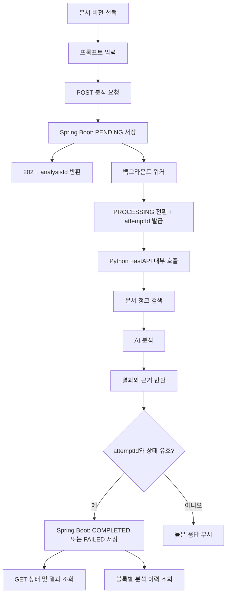

# 🤖 비타메이트 문서 분석 AI v1 — 유스케이스 시나리오

**최종 업데이트**: 2026-08-03 (CodeRabbit 피드백 재반영 — attemptId 기반 늦은 응답 차단 보강)
**담당**: 정현

> 테이블 단위로 시나리오를 나눈다. `시스템`은 사용자 조작 없이 서버가 수행하는 단계다.

---

## 1. `vitamate_block`

| 유스케이스 시나리오 ID | 시나리오 | 사용자 |
|---|---|---|
| USC-VIT-BLK-001 | AI 블록 생성 | 스텝 편집 권한 보유자 |
| USC-VIT-BLK-002 | AI 블록 환영 문구 조회 | 스텝 접근 권한 보유자 |
| USC-VIT-BLK-003 | AI 블록 분석 실행 이력 조회 | 스텝 접근 권한 보유자 |

---

## 2. `vitamate_analysis`

| 유스케이스 시나리오 ID | 시나리오 | 사용자 |
|---|---|---|
| USC-VIT-ANA-001 | 문서 버전 선택 | 스텝 접근 권한 보유자 |
| USC-VIT-ANA-002 | 프롬프트 입력 | 스텝 접근 권한 보유자 |
| USC-VIT-ANA-003 | 분석 요청 | 스텝 접근 권한 보유자 |
| USC-VIT-ANA-004 | 분석 상태 `PENDING` 저장 | 시스템 |
| USC-VIT-ANA-005 | `analysisId` 반환 | 시스템 |
| USC-VIT-ANA-006 | 백그라운드 워커가 `attemptId`를 발급하고 `PROCESSING`으로 전환 | 시스템 |
| USC-VIT-ANA-007 | 현재 `attemptId`가 맞을 때만 분석 완료 결과 저장 | 시스템 |
| USC-VIT-ANA-008 | 현재 `attemptId`가 맞을 때만 분석 실패 메시지 저장 | 시스템 |
| USC-VIT-ANA-009 | 재분석 시 새 이력 생성 | 시스템 |
| USC-VIT-ANA-010 | `Idempotency-Key`로 같은 요청 중복 방지 | 시스템 |
| USC-VIT-ANA-011 | 만료되었거나 이전 attempt의 늦은 응답 무시 | 시스템 |

---

## 3. `vitamate_analysis_document`

| 유스케이스 시나리오 ID | 시나리오 | 사용자 |
|---|---|---|
| USC-VIT-DOC-001 | 분석 대상 문서 버전 저장 | 시스템 |
| USC-VIT-DOC-002 | 같은 분석 안의 문서 버전 중복 차단 | 시스템 |
| USC-VIT-DOC-003 | 분석 결과 조회 시 선택 문서 목록 제공 | 시스템 |

---

## 4. `document_chunk`

| 유스케이스 시나리오 ID | 시나리오 | 사용자 |
|---|---|---|
| USC-VIT-CHK-001 | 문서 청크 메타데이터 저장 | 시스템 |
| USC-VIT-CHK-002 | ChromaDB 식별자 저장 | 시스템 |
| USC-VIT-CHK-003 | 임베딩 상태 관리 | 시스템 |
| USC-VIT-CHK-004 | 선택 문서 범위 내 청크 검색 | Python 서버 |

---

## 5. `vitamate_analysis_citation`

| 유스케이스 시나리오 ID | 시나리오 | 사용자 |
|---|---|---|
| USC-VIT-CIT-001 | 분석 근거 청크 저장 | 시스템 |
| USC-VIT-CIT-002 | 근거 순서 저장 | 시스템 |
| USC-VIT-CIT-003 | 분석 결과 조회 시 근거 목록 제공 | 시스템 |
| USC-VIT-CIT-004 | 같은 분석 안의 근거 순서 중복 차단 | 시스템 |
| USC-VIT-CIT-005 | 선택 문서 범위 밖 청크 저장 차단 | 시스템 |

---

## 전체 흐름

