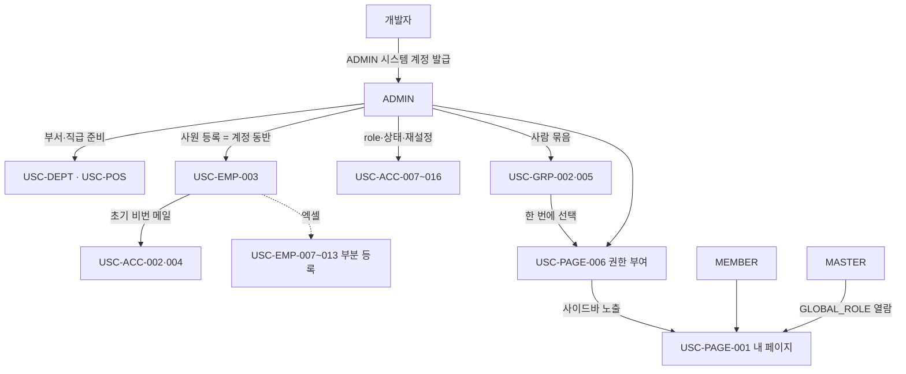

가# 🔄 인사(HR) v1 — 유스케이스

**최종 업데이트**: 2026-08-04 (인사 6개 하위 영역 통합 시나리오 목록 초판)
**담당**: 김동현
**근거**: [`HR-V1.md`](HR-V1.md) 요구사항 · `../../../api/account.md` · `employee.md` · `department.md` · `job-position.md` · `employee-group.md` · `page-permission.md`

> **무엇을 빠짐없이 만들어야 하는가**를 테이블/기능 단위로 센다. 무엇을 보장하나는 [`HR-V1.md`](HR-V1.md) 소관이다.
> 번호는 API 명세 사본이 쓰는 `USC-{영역}-{nn}` 을 그대로 이어받는다.

---

## 0. 등장 인물

| 행위자 | role | 이 도메인에서 하는 일 |
|--------|------|-------------------|
| 조직 관리자 | `ADMIN`(시스템 계정) | 계정 발급·재설정·role 변경 · 사원/부서/직급/그룹 CRUD · 페이지 권한 부여 |
| CEO | `MASTER` | 전사 열람·개입. **부여·회수는 못 한다.** role 게이트로 페이지를 연다 |
| 일반 사용자 | `MEMBER` | 부서·그룹 목록 조회 · 내 페이지 목록으로 사이드바를 받는다 |
| 개발자 | 외부 | `ADMIN` 시스템 계정을 직접 발급한다(애플리케이션 밖) |
| 시스템 | — | 인원 집계 · 자연키/중복 검증 · 초기 비번 메일 발송 |

---

## A. 계정 (`ACC`)

| ID | 시나리오 | 사용자 | 요구사항 |
|----|---------|--------|---------|
| USC-ACC-002 | 사원 등록과 동시에 계정 발급 | ADMIN | ACC-002·ACC-004 |
| USC-ACC-004 | 초기 비밀번호 난수 생성·해시 저장·메일 발송 | 시스템 | ACC-004·ACC-021·ACC-022 |
| USC-ACC-007 | 전역 role 변경(`MASTER`↔`MEMBER`) | ADMIN | ACC-009·ACC-001 |
| USC-ACC-008 | 계정 상태 `ACTIVE`↔`INACTIVE` 토글 | ADMIN | ACC-011 |
| USC-ACC-009 | 이미 같은 상태로의 변경 거부 | 시스템 | ACC-012 |
| USC-ACC-010 | 비밀번호 재설정 요청(개인·다중 통합) | ADMIN | ACC-007·ACC-013 |
| USC-ACC-011 | 존재하지 않는 사번 포함 시 전체 거부 | 시스템 | ACC-014 |
| USC-ACC-012 | 이메일 미등록 대상은 비번을 바꾸지 않음 | 시스템 | ACC-015 |
| USC-ACC-013 | 메일 발송 실패 건 `passwordChanged=true` 표기 | 시스템 | ACC-016 |
| USC-ACC-014 | 재설정 결과 집계(`requested/success/failed`) | 시스템 | ACC-017·ACC-018 |
| USC-ACC-015 | `재발송` = 새 난수 재설정 | ADMIN | ACC-019·ACC-020 |
| USC-ACC-016 | `ADMIN` 계정 재설정 대상 거부 | 시스템 | ACC-023·ACC-024 |
| USC-ACC-017 | 자기 자신의 role 행 수정 차단 | 시스템 | ACC-009 |
| USC-ACC-018 | 시스템 계정을 변경 대상에서 차단 | 시스템 | ACC-009·ACC-011 |

## B. 사원 (`EMP`)

| ID | 시나리오 | 사용자 | 요구사항 |
|----|---------|--------|---------|
| USC-EMP-001 | 사원 목록 조회(검색·필터·페이징) | ADMIN | EMP-001 |
| USC-EMP-002 | 사원 상세 조회(부서·직급·그룹 포함) | ADMIN | EMP-002 |
| USC-EMP-003 | 사원 등록(계정 동반) | ADMIN | EMP-004·ACC-002 |
| USC-EMP-004 | 사원 정보 부분 수정 | ADMIN | EMP-013 |
| USC-EMP-005 | `departmentId` 로 부서 배정 변경 | ADMIN | EMP-014 |
| USC-EMP-006 | 퇴사 처리(퇴사일 기록 + 계정 자동 비활성화) | ADMIN | EMP-015·EMP-016 |
| USC-EMP-007 | 엑셀 템플릿 내려받기 | ADMIN | EMP-005 |
| USC-EMP-008 | 엑셀 파일 사전 검증(없음·형식·크기) | 시스템 | EMP-006 |
| USC-EMP-009 | 행별 필수 컬럼 누락 검출 | 시스템 | EMP-009 |
| USC-EMP-010 | 파일 내 사번 중복 검출 | 시스템 | EMP-007 |
| USC-EMP-011 | 부서명 미존재 검출 | 시스템 | EMP-008 |
| USC-EMP-012 | 엑셀 `ADMIN` 권한 부여 거부 | 시스템 | EMP-010 |
| USC-EMP-013 | 오류 제외 부분 등록 + 결과 집계 | ADMIN | EMP-011·EMP-012·EMP-019 |
| USC-EMP-014 | 시스템 계정 전 조회 제외 | 시스템 | EMP-003·EMP-017 |

## C. 부서 (`DEPT`)

| ID | 시나리오 | 사용자 | 요구사항 |
|----|---------|--------|---------|
| USC-DEPT-001 | 부서 목록 트리 조회 | 전체 사용자 | DEPT-001 |
| USC-DEPT-002 | 부서 인원 수 집계(직속·하위 포함) | 시스템 | DEPT-002 |
| USC-DEPT-003 | 최상위 부서 생성 | ADMIN | DEPT-003 |
| USC-DEPT-004 | 하위 부서 생성 | ADMIN | DEPT-004 |
| USC-DEPT-005 | 계층 2단 초과 차단 | 시스템 | DEPT-005 |
| USC-DEPT-006 | 부서명 중복 검증 | 시스템 | DEPT-006 |
| USC-DEPT-007 | 부서명 수정 | ADMIN | DEPT-007 |
| USC-DEPT-008 | 부서 삭제 | ADMIN | DEPT-008 |
| USC-DEPT-009 | 소속 사원·하위 부서 삭제 차단 | 시스템 | DEPT-009·DEPT-010 |
| USC-DEPT-010 | 소속 사원 보기(`GET /employees?departmentId=`) | ADMIN | DEPT-001·EMP-001 |

## D. 직급 (`POS`)

| ID | 시나리오 | 사용자 | 요구사항 |
|----|---------|--------|---------|
| USC-POS-001 | 직급 목록 조회 | ADMIN | POS-001 |
| USC-POS-002 | 직급 사용 인원 집계 | 시스템 | POS-002 |
| USC-POS-003 | 직급 생성 | ADMIN | POS-003 |
| USC-POS-004 | 직급명 중복 검증 | 시스템 | POS-004 |
| USC-POS-005 | 직급명 수정 | ADMIN | POS-005 |
| USC-POS-006 | 정렬 순서 변경 | ADMIN | POS-006 |
| USC-POS-007 | 직급 삭제 | ADMIN | POS-007 |
| USC-POS-008 | 사용 중 직급 삭제 차단 | 시스템 | POS-008 |

## E. 그룹 (`GRP`)

| ID | 시나리오 | 사용자 | 요구사항 |
|----|---------|--------|---------|
| USC-GRP-001 | 그룹 목록 조회 | 전체 사용자 | GRP-001 |
| USC-GRP-002 | 빈 그룹 생성(이름 중복 검증) | ADMIN | GRP-002 |
| USC-GRP-003 | 그룹 이름·설명 수정 | ADMIN | GRP-003 |
| USC-GRP-004 | 그룹 삭제(구성원 매핑 CASCADE) | ADMIN | GRP-004·GRP-010 |
| USC-GRP-005 | 구성원 목록 조회 + 다건 추가(멱등) | 전체 사용자 · ADMIN | GRP-005·GRP-007·GRP-008·GRP-009 |
| USC-GRP-006 | 구성원 한 명 제거 | ADMIN | GRP-006 |
| USC-GRP-008 | 그룹으로 페이지 권한 일괄 부여(개인 스냅샷 저장) | ADMIN | GRP-010·PAGE-010 |

## F. 페이지 권한 (`PAGE`)

| ID | 시나리오 | 사용자 | 요구사항 |
|----|---------|--------|---------|
| USC-PAGE-001 | 내 페이지 목록 조회(사이드바 노출) | 전체 사용자 | PAGE-001 |
| USC-PAGE-002 | `NONE`/`VIEWER`/`EDITOR` 노출·접근 분리 | 시스템 | PAGE-002 |
| USC-PAGE-003 | `ADMIN`·`MASTER` 의 `GLOBAL_ROLE` 열람 | 시스템 | PAGE-003·PAGE-004 |
| USC-PAGE-004 | 페이지 목록·접근 가능자 조회 | ADMIN | PAGE-005 |
| USC-PAGE-005 | 접근 가능자 UNION 집계(부여 + 전역권한) | 시스템 | PAGE-006 |
| USC-PAGE-006 | 권한 부여(부분 반영) | ADMIN | PAGE-007 |
| USC-PAGE-007 | 등급 변경(부여와 동일 API) | ADMIN | PAGE-008 |
| USC-PAGE-008 | 권한 회수(`MASTER` 는 열람 유지) | ADMIN | PAGE-009 |

---

## 전체 흐름

---

## 영역별 시나리오 수

| 영역 | 시나리오 수 |
|------|:-----------:|
| 계정 `ACC` | 14 |
| 사원 `EMP` | 14 |
| 부서 `DEPT` | 10 |
| 직급 `POS` | 8 |
| 그룹 `GRP` | 7 |
| 페이지권한 `PAGE` | 8 |
| **합계** | **61** |

---

## 🚧 이 문서가 확정되려면

| # | 확인 | 걸리는 시나리오 |
|---|------|----------------|
| 1 | 그룹 관리 주체 — `ADMIN` 전용인가 `MASTER` 도 허용인가 | USC-GRP-002~006 |
| 2 | 직급 관리 화면(P-62) 부재 | USC-POS-003~007 |
| 3 | 퇴사 처리 화면 진입점 부재 | USC-EMP-006 |
| 4 | 부서 이동(상위 변경) 필요 여부 | USC-DEPT-007 |
| 5 | `내 프로젝트` 의 `ADMIN` 제외 여부 최종 확인 | USC-PAGE-001 |
