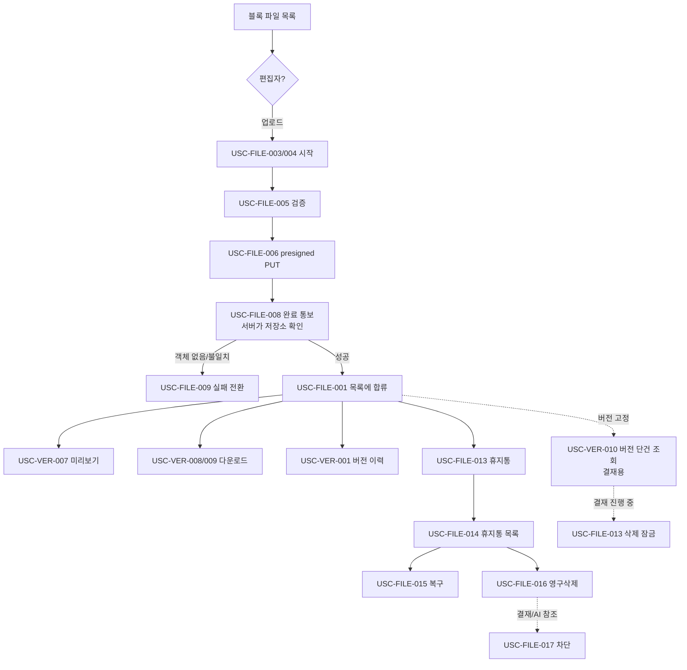

# 🔄 파일 · 파일 버전 v1 — 유스케이스

**최종 업데이트**: 2026-08-04 (초안 작성 — 기능 단위 시나리오 목록)
**담당**: 김동현
**근거**: [`FILE-V1.md`](FILE-V1.md) 요구사항 · [`../../../api/file.md`](../../../api/file.md) 엔드포인트 · [`../../global/BLOCK.md`](../../global/BLOCK.md) §4-4·§8 · [`../../global/PERMISSION.md`](../../global/PERMISSION.md) §4·§6

> **어떻게 흐르는가**를 담는다. 무엇을 만드나는 [`FILE-V1.md`](FILE-V1.md) 소관이다.
> 시나리오 ID 는 `USC-FILE-{nnn}` · `USC-VER-{nnn}` — API 명세가 요구사항 칸에서 이 번호를 그대로 참조한다.

---

## 0. 등장 인물

| 행위자 | 이 영역에서 하는 일 |
|--------|-------------------|
| **편집자** (스텝 `EDITOR`) | 업로드 · 새 버전 · 문서명 수정 · 삭제 · 복구 · 영구삭제 |
| **열람자** (스텝 `VIEWER`) | 목록 · 버전 이력 · 미리보기 · 다운로드 (조회만) |
| **결재 블록** | 파일 블록을 지목하고 `file_version_id` 로 버전을 고정. 버전 단건 조회로 그 버전을 연다 |
| **정리 배치** (시스템) | 미완료 `업로드중` 버전 회수 |
| **저장소** (외부) | presigned PUT/GET 대상. 서버가 객체 존재를 직접 확인 |

> ⛔ **파일 단위 권한이 없다.** 위 `EDITOR`/`VIEWER` 는 파일이 붙은 **스텝의 권한**이고, 3층 상속(`step_permission` → `project_member`)으로 판정한다 (USC-FILE-002).

---

## A. 업로드

### USC-FILE-003. 새 문서 업로드 시작

| | |
|---|---|
| **행위자** | 편집자 |
| **화면** | 파일 블록 목록 → 업로드 |
| **선행조건** | 블록이 살아 있다(`block.deleted_at IS NULL`) · 스텝 편집 권한 |
| **요구사항** | FILE-004·006·010·011 · VER-004 |

**기본 흐름**

1. `업로드` 클릭 → 파일 선택 (`fileId` 없음 = 새 문서)
2. 서버가 크기·확장자·동명을 검증한다 (USC-FILE-005)
3. 버전을 **`업로드중` 상태로 생성**하고 `uploadUrl`·`expiresAt` 을 발급한다
4. 응답 — `fileId` · `fileVersionId` · `versionNo(=1)` · `uploadUrl` · `expiresAt`
5. 클라이언트가 `uploadUrl` 로 저장소에 직접 PUT → USC-FILE-008 로

**분기 · 예외**

| 상황 | 결과 |
|------|------|
| `name` 생략 | 확장자를 뗀 원본 파일명이 표시명이 된다 (VER-004) |
| 삭제된 블록에 업로드 | `404 FILE_BLOCK_NOT_FOUND` |

---

### USC-FILE-004. 새 버전 업로드 시작

| | |
|---|---|
| **행위자** | 편집자 |
| **요구사항** | FILE-004 · VER-002·003·005 |

**기본 흐름**

1. 기존 문서에서 `새 버전` 클릭 → `fileId` 를 실어 호출
2. 서버가 같은 검증을 거쳐 **`versionNo` 를 증가**시켜 새 버전을 append 한다
3. 코멘트를 입력하면 버전에 남는다 (VER-005)
4. 이후 흐름은 새 문서와 동일 (presigned → PUT → 완료 통보)

> ⛔ **새 문서와 새 버전은 같은 API 다.** `fileId` 유무로만 갈린다 (FILE-004).

---

### USC-FILE-005. 업로드 사전 검증

| | |
|---|---|
| **요구사항** | FILE-007·008·009 |

| 검증 | 실패 시 |
|------|--------|
| 크기 50MB 초과 | `400 FILE_SIZE_EXCEEDED` — presigned 발급 안 함 |
| 실행 파일 확장자 | `400 FILE_EXTENSION_BLOCKED` (블랙리스트) |
| 동명 문서 존재 | `409 FILE_NAME_DUPLICATED` → 사용자 확인 후 `allowDuplicateName: true` 재요청 |

---

### USC-FILE-006. presigned 발급 · 클라이언트 직접 PUT

| | |
|---|---|
| **요구사항** | FILE-006 · VER-012 |

1. 서버는 **메타데이터만** 만들고 파일 바이너리를 받지 않는다
2. 클라이언트가 `uploadUrl` 로 저장소에 직접 PUT
3. 서버 대역폭·메모리를 쓰지 않는다

> ⚠️ 이 시점엔 DB 버전이 `업로드중` 이고 저장소엔 아직 객체가 없을 수 있다. **둘의 정합성은 완료 통보에서 맞춘다** (USC-FILE-008).

---

### USC-FILE-008. 업로드 완료 통보 — 서버가 저장소 확인 ⭐

| | |
|---|---|
| **행위자** | 편집자 → 서버 → 저장소 |
| **요구사항** | FILE-013 · VER-006·008 |

**기본 흐름**

1. 클라이언트가 `POST /uploads/{fileVersionId}/complete` 호출 (`checksum` 선택)
2. **서버가 저장소에 객체가 실제로 있는지 직접 확인**한다
3. 있으면 버전을 **`완료`로 전환**하고 업로더 스냅샷(이름·부서·직책)을 박는다 (VER-006)
4. PDF 면 총 페이지 수를 추출한다 — 실패해도 완료 처리하고 `pageCount` 만 비운다 (VER-008)
5. 응답 — 버전 상세 전체(파일명·확장자·크기·pageCount·업로더 스냅샷·completedAt)

**분기 · 예외 → USC-FILE-009**

---

### USC-FILE-009. 업로드 실패 전환

| | |
|---|---|
| **요구사항** | FILE-011·012·013 |

| 상황 | 결과 |
|------|------|
| 저장소에 객체 없음 | `409 FILE_OBJECT_NOT_FOUND` — 버전을 **`실패`로 전환** |
| 크기·체크섬 불일치 | `409 FILE_SIZE_MISMATCH` / `FILE_CHECKSUM_MISMATCH` |
| 이미 완료된 버전 | `400 FILE_ALREADY_COMPLETED` |
| 완료 통보가 영영 안 옴 | `업로드중` 버전은 정리 배치가 회수 (FILE-012, 잠정 24h) |

> 🔑 **클라이언트의 "완료" 통보만 믿지 않는다.** 안 올리고 완료만 보내면 깨진 링크가 생긴다 (INV-01).

---

## B. 조회

### USC-FILE-001. 블록 파일 목록 조회

| | |
|---|---|
| **행위자** | 열람자 이상 |
| **요구사항** | FILE-001·002·003·005·015 |

1. `GET /blocks/{blockId}/files` → 블록의 파일 목록
2. **완료 버전이 0개인 문서는 빠진다** (FILE-002)
3. 정렬은 블록 연결일 오름차순 (FILE-003)
4. `canEdit` 로 업로드/삭제 버튼 노출을 판단한다 (FILE-005)

**분기 · 예외**

| 상황 | 결과 |
|------|------|
| 블록이 soft delete 됨 | `404 FILE_BLOCK_NOT_FOUND` — `block.deleted_at IS NULL` 명시 확인 (FILE-015) |
| 파일 없음 | `200` + 빈 배열 |

---

### USC-FILE-014. 휴지통 목록 조회

| | |
|---|---|
| **요구사항** | FILE-020·022 |

1. 같은 API 에 `deleted=true` → 휴지통 문서 목록
2. `deletedAt`(진입 시각)이 채워져 온다
3. 보관 기간 제한이 없다 (FILE-022)

> ⛔ 데이터·권한이 같아 **API 를 나누지 않았다** (FILE-020).

---

### USC-VER-001. 버전 이력 조회

| | |
|---|---|
| **요구사항** | VER-001·006·007 |

1. `GET /files/{fileId}/versions` → **차수 내림차순**
2. 각 버전의 업로더 스냅샷·코멘트·완료 시각이 보인다
3. **버전 삭제·되돌리기 버튼이 없다** (append-only)
4. 업로드 실패 버전은 반환되지 않는다

---

### USC-VER-007. 미리보기 (PDF 앞 5페이지)

| | |
|---|---|
| **요구사항** | VER-009·010 · INV-12 |

1. `GET /file-versions/{fileVersionId}/preview`
2. **서버가 앞 5페이지를 잘라 PDF 바이너리로 반환**한다 (JSON 아님)
3. 헤더 `X-Preview-Page-Count`·`X-Total-Page-Count` 로 "전체는 다운로드" 문구를 만든다

**분기 · 예외**

| 상황 | 결과 |
|------|------|
| PDF 가 아님 | `409 FILE_PREVIEW_NOT_SUPPORTED` → 다운로드 안내 |
| 업로드 미완료 버전 | `409 FILE_UPLOAD_NOT_COMPLETED` |
| 문서가 휴지통 | `404 FILE_VERSION_NOT_FOUND` |
| PDF 처리 실패 | `500 FILE_PREVIEW_FAILED` |

> 🔑 **presigned 를 안 주는 이유** — 주면 클라이언트가 전체 PDF 에 접근해 5페이지 제한이 무의미해진다.

---

### USC-VER-008. 다운로드 URL 발급

| | |
|---|---|
| **요구사항** | FILE-014 · VER-011·012 |

1. `GET /file-versions/{fileVersionId}/download`
2. **저장소 다운로드 URL** + `expiresAt` 을 발급한다 (바이너리 아님)
3. **열람 권한이면 다운로드까지 된다** (FILE-014)

**분기 · 예외**

| 상황 | 결과 |
|------|------|
| 업로드 미완료 버전 | `409 FILE_UPLOAD_NOT_COMPLETED` |
| 버전 없음/문서 휴지통 | `404 FILE_VERSION_NOT_FOUND` |

---

### USC-VER-009. 과거 버전 다운로드

| | |
|---|---|
| **요구사항** | VER-011 |

1. 버전 이력에서 특정 차수를 고른다
2. **최신과 같은 API** 로 `fileVersionId` 를 지목해 발급받는다

---

### USC-VER-010. 버전 단건 조회 (결재용) ⭐

| | |
|---|---|
| **행위자** | 결재 블록 |
| **요구사항** | VER-013 · FILE-033 · INV-11 |

**기본 흐름**

1. 결재 블록은 상신 시점 `file_version_id` 를 `approval_document` 에 박아 **버전을 고정**한다
2. 결재 화면이 `GET /file-versions/{fileVersionId}` 로 그 버전 하나를 연다
3. `latest=false` 면 **`대상보다 새 버전 있음` 경고 배지**를 띄운다 (`latestVersionNo` 로 문구 구성)
4. **문서가 휴지통에 있어도 반환**한다(`fileDeleted: true`) — 결재 이력은 지워진 뒤에도 무엇을 결재했는지 보여야 한다

**분기 · 예외**

| 상황 | 결과 |
|------|------|
| 버전 없음 | `404 FILE_VERSION_NOT_FOUND` |

> ⚠️ 다운로드·미리보기와 달리 **휴지통이어도 `404` 가 아니다.**

---

## C. 수정 · 삭제

### USC-FILE-012. 문서명 수정

| | |
|---|---|
| **요구사항** | FILE-016 |

1. `PATCH /files/{fileId}` — 표시명만 변경 (최대 255자)
2. **원본 파일명은 안 바뀐다.** 버전마다 저장된 원본명은 그대로

**분기 · 예외**

| 상황 | 결과 |
|------|------|
| 이름 비었거나 255자 초과 | `400 FILE_INVALID_REQUEST` |
| 문서 없음/이미 휴지통 | `404 FILE_NOT_FOUND` |

---

### USC-FILE-013. 휴지통으로 이동

| | |
|---|---|
| **요구사항** | FILE-018·019 · FILE-031 |

1. `DELETE /files/{fileId}` → 삭제 시각만 기록 (soft delete)
2. **저장소 객체는 유지**된다 (복구 대비)
3. 편집 권한자면 누구나 지운다 (업로더 본인 제한 없음)

**분기 · 예외**

| 상황 | 결과 |
|------|------|
| 진행 중 결재의 대상 파일 | `409 FILE_APPROVAL_IN_PROGRESS` — 결재를 회수·완료해야 (FILE-031) |
| 이미 휴지통 | `400 FILE_ALREADY_DELETED` |

---

### USC-FILE-015. 휴지통에서 복구

| | |
|---|---|
| **요구사항** | FILE-021 · INV-05 |

**기본 흐름**

1. `POST /files/{fileId}/restore` → **원래 블록으로 복구**
2. 블록 연결은 휴지통 동안에도 유지돼 그 자리로 돌아온다

**분기 · 예외**

| 상황 | 결과 |
|------|------|
| 원래 블록이 삭제됨 | 복구는 **성공**하되 블록에 안 붙는다 — `blockId: null` · `blockDeleted: true`. 프론트는 "프로젝트 문서함으로 복구" 안내 |
| 휴지통에 없음 | `400 FILE_NOT_DELETED` |

> ⭐ **블록이 삭제돼도 파일은 산다** (INV-05). 이전 명세의 `FILE_BLOCK_DELETED`(복구 불가)는 폐기됐다.

---

### USC-FILE-016. 영구 삭제 — 확인 문자 검증

| | |
|---|---|
| **요구사항** | FILE-023·024·025 |

**기본 흐름**

1. 휴지통 문서에서 `영구 삭제` → `confirmText` 입력
2. 서버가 **정확히 `영구 삭제`인지 검증**한다
3. **모든 버전의 저장소 객체를 제거**하고 DB 에서 지운다
4. 응답 — `deletedVersionCount` · `storageDeletedCount`

**분기 · 예외**

| 상황 | 결과 |
|------|------|
| 확인 문자 불일치 | `400 FILE_CONFIRM_TEXT_MISMATCH` |
| 휴지통에 없음 | `400 FILE_NOT_DELETED` |
| 저장소 삭제 일부 실패 | **DB 는 지운다.** 실패 키는 정리 대상으로 남긴다 |

---

### USC-FILE-017. 영구 삭제 차단 — 결재/AI 참조

| | |
|---|---|
| **요구사항** | FILE-032·034 · INV-10 |

1. 영구삭제 전, 이 파일의 버전을 **결재가 참조하는지** 확인한다
2. **완료된 결재까지 포함해** 참조가 있으면 `409 FILE_APPROVAL_REFERENCED`
3. 지우면 결재 이력에서 문서를 열 수 없게 되기 때문 (되돌릴 수 없음)

> ⚠️ **확인 필요** — AI 분석 참조(`vitamate_analysis_document.file_version_id`)까지 차단 대상인지 미정 (FILE-034). 명세 미반영.

---

## D. 권한 (횡단)

### USC-FILE-002. 권한 판정 — 3층 상속

| | |
|---|---|
| **요구사항** | FILE-026·027·028·029 · INV-09 |

**판정 순서**

```
1) 전역 role
     ADMIN / MASTER → 통과 (수정 시 privileged_override 기록)
     MEMBER         → 계속
2) 파일 → 스텝 찾기
     file → block_file → block → step
3) 스텝 권한
     step_permission 행 있음 → 그 값        (오버라이드)
     행 없음                 → project_member (상속)
     project_member 에도 없음 → 차단
     NONE                    → 차단
     VIEWER                  → 미리보기·다운로드·조회
     EDITOR                  → 업로드·수정·삭제
```

**분기 · 예외**

| 상황 | 결과 |
|------|------|
| 조회 권한 없음 | `403 FILE_ACCESS_PERMISSION_REQUIRED` |
| 편집 권한 없음 | `403 FILE_EDIT_PERMISSION_REQUIRED` |
| 세션 없음/만료 | `401 AUTH_UNAUTHENTICATED` |

> 🔴 **3층 상속을 빼먹으면 안 된다.** `step_permission` 만 보면 프로젝트 권한만 가진 참여자가 전부 차단된다 (`PERMISSION.md` §4-1).

---

## 전체 흐름



---

## 🚧 이 문서가 확정되려면

| # | 확인 | 걸리는 유스케이스 |
|---|------|----------------|
| 1 | 저장소 SDK(S3·presigned) 결정 · 추상화 인터페이스 확정 | USC-FILE-003·006·008·016 |
| 2 | presigned 업로드·다운로드 URL 만료 시간 | USC-FILE-003 · USC-VER-008 |
| 3 | 미완료 업로드 정리 주기 (잠정 24h) | USC-FILE-009·012 |
| 4 | `activity_log` 기록 방식 (도메인 이벤트 구독안) | 전 유스케이스 |
| 5 | AI 분석 참조까지 영구삭제 차단 대상인가 | USC-FILE-017 |
| 6 | 휴지통 · 업로드 진행 화면 목업 | USC-FILE-014 · USC-FILE-003 |
