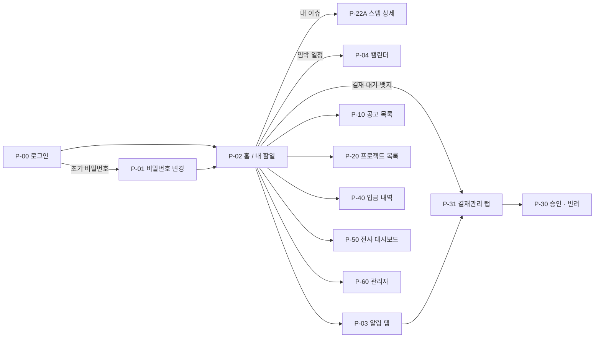
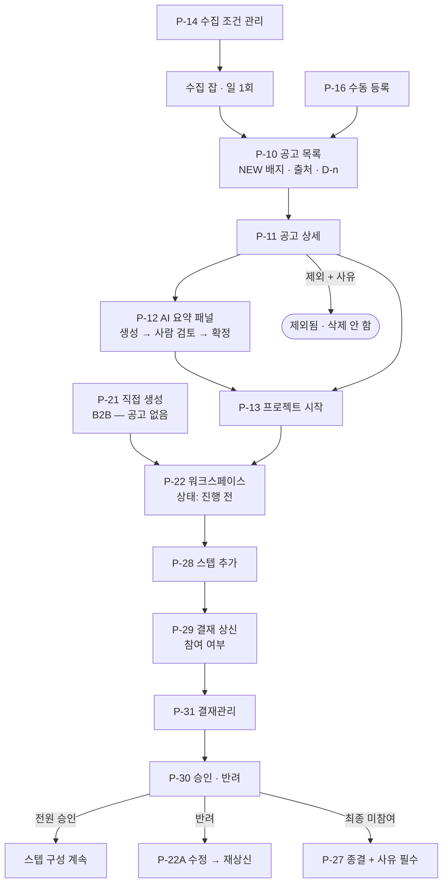
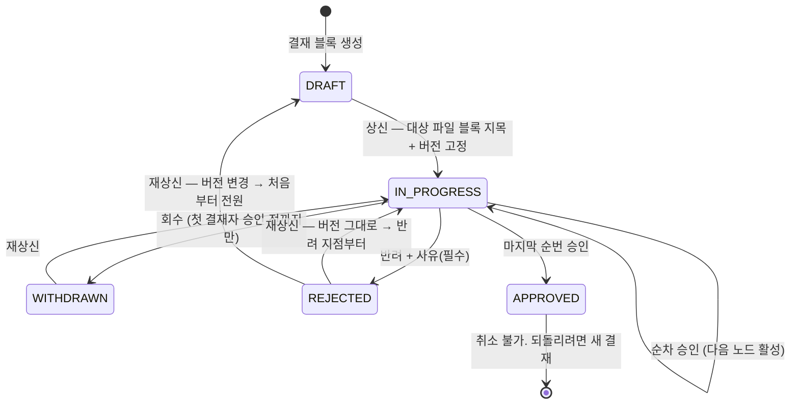
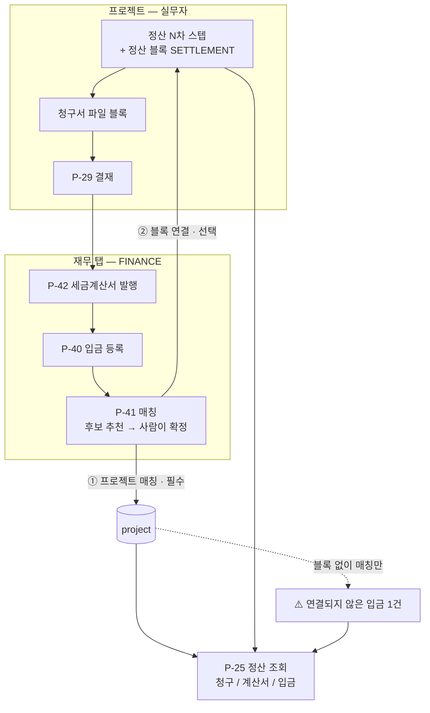

# 🖥️ 페이지 체계 — 탭 8개 · 화면 38개

**최종 업데이트**: 2026-08-16 (§0 TL;DR 신설 · 사이드바 "7개"→"6개" 정정 · template 저장소 이슈 해결 반영 · role/`page_code` 설명을 PERMISSION.md 링크로 축약 · **폐기된 「입금확인 블록」 명칭을 「정산 블록(`SETTLEMENT`)」 으로 교체** — §3-2·§5-4, 흐름은 그대로) · 이전 2026-08-03 · 이전 2026-08-01
**작성/관리**: 동훈 · **2026-08-03 수정**: 동현

## §0 TL;DR

- 이 문서가 정하는 것: 화면 38개의 역할·담당(백엔드/프론트)과 페이지 흐름. 실제 사이드바는 **6개**(page_code 카탈로그, 정본은 [`PERMISSION.md` §3-1](PERMISSION.md)) — 기획 단계의 8탭과 다르다.
- ⚠️ 조용히 깨지는 함정: ① 프로젝트 안엔 별도 개요 화면이 없다 — 사이드바 자체가 개요다. ② 정산(P-25)·문서(P-24) 메뉴는 **조회 전용**이라 등록·수정 버튼을 만들면 안 된다.

| 섹션 | 내용 |
|---|---|
| §1 | 최상위 탭 8개(기획) vs 실제 사이드바 6개. `page_code` 부여 대상은 `BIDDING`·`FINANCE` 2개뿐 (정본 [`PERMISSION.md` §3-1](PERMISSION.md)) |
| §2 | 화면 38개 목록 — ID·권한·역할·백엔드/프론트 담당 |
| §3 | 프로젝트 내부 구조 — 사이드바 = 개요, 문서는 `스테이지 > 스텝` 고정, 정산은 조회 전용 |
| §4 | 결재관리 탭 — 프로젝트 안은 상신만, 승인·반려는 P-31 에서 |
| §5 | 페이지 흐름 다이어그램 (진입 · 공고→프로젝트 · 결재상태 · 정산 2단매칭 · 전 구간) |
| §6 | 화면 미결 목록 — 랜딩 화면 · 캘린더 범위 · 파일 저장소 · `performance` 테이블 등 |

---

> 이 문서는 **어떤 화면이 있고 각 화면이 무슨 역할인가**, 그리고 **누가 만드나**를 정의한다.

> 🔑 **권한 표기** — 전역 role 서열 · `page_code` 카탈로그의 정본은 [`PERMISSION.md` §1~§3](PERMISSION.md) 이다.
> `BIDDING` · `FINANCE` 는 role 이 아니라 **`page_permission.page_code`** 값이다.
>
> ✅ **`page_code` 확정** (2026-08-03 재확정 · 노션 반영 완료) — **카탈로그 6개 · 부여 대상 2개**(`BIDDING`·`FINANCE`).
> 상세는 [`PERMISSION.md` §3-1](PERMISSION.md) 과 §1 하단 사이드바 표.
>
> ⭐ **`ADMIN` 은 시스템 계정이다** (2026-08-03) — 실제 사원에게 부여하는 role 이 아니다. [`PERMISSION.md` §2-4](PERMISSION.md)

---

## 1. 최상위 탭 — 8개

```
┌────────────────────────────────────────────────────────────────────────┐
│ 로고 │ 홈 · 알림 · 결재관리 · 공고/입찰 · 프로젝트 · 재무 · 전사현황 · 관리자 │ 👤 │
└────────────────────────────────────────────────────────────────────────┘
        └─ page_code 가 붙은 탭은 행이 없으면 탭 자체가 안 보인다
```

| 탭 | 권한 | 기준 | **역할 — 이 탭에서 무엇을 하나** |
|-----|------|:----:|------------------------------|
| **홈 / 내 할일** | **전원** | ② | 로그인 직후 랜딩. 내 이슈 · 결재 대기 · 임박 일정을 사람 기준으로 모아 본다 |
| **알림** | **전원** | ② | ACTION 뱃지(처리까지 안 사라짐)와 INFO 피드를 **분리해서** 본다 |
| **결재관리** | **전원** | ② | **내 결재선에 걸린 건만** 가로로 훑고 승인·반려한다. 남의 결재는 목록에 안 뜬다 |
| **공고 / 입찰** | `page_code='BIDDING'` | ① | 수집된 공고를 보고 판단해 **프로젝트로 넘긴다.** 프로젝트 생성 이전 단계 |
| **프로젝트** | **전원.** 안쪽은 `project_member` 가 통제 | ① | 본체. 계층·문서·이슈·정산 조회·로그가 전부 여기 매달린다 |
| **재무** | `page_code='FINANCE'` | ① | 프로젝트 **밖에서** 돈을 확정한다 — 입금 등록·매칭 · 세금계산서 발행 · 실적 등재 |
| **전사 현황** | **`MASTER` 이상** | ① | 전사 집계를 읽는다 — 상태별·부서별·카테고리별·종결 사유 분포 |
| **관리자** | **`ADMIN`** | ① | 계정·role·화면권한 부여 · 사원·부서·카테고리 · 템플릿 전사 승격 |

**기준 ①② 는 탭을 만드는 두 조건이다.**
① 프로젝트 밖에 자기 데이터가 있다 → `page_code` **있음** (관리자·전사현황은 role 로 대체)
② "내 것"을 사람 기준으로 모아 보는 뷰다 → `page_code` **없음, 전원 오픈**

> 🚨 **위 8탭 표는 기획 단계 구조다. 실제 사이드바는 아래 6개다** (2026-08-03 화면 확인 · [`PERMISSION.md` §3-1](PERMISSION.md) 카탈로그와 일치, 이전 "7개" 표기는 오기).
>
> | 사이드바 | `page_code` | `ADMIN` | `MASTER` | `MEMBER` |
> |---|---|:---:|:---:|:---:|
> | 공고 조회 · 입찰 관리 | `BIDDING` | ✅ | ✅ | 노출 O · **접근은 부여 필요** |
> | 재무 관리 | `FINANCE` | ✅ | ✅ | 〃 |
> | 프로젝트 생성 | `PROJECT_CREATE` | ❌ | ✅ | ✅ |
> | 내 프로젝트 | `MY_PROJECT` | ❌ | ✅ | ✅ |
> | 템플릿 관리 ⭐신규 | `TEMPLATE` | ✅ | ❌ | ❌ |
> | 설정 | `SETTINGS` | ✅ | ✅ | ✅ |
>
> ⭐ **설정은 전원 노출, 하위 항목만 role 로 갈린다** — `ADMIN` 은 사원·부서·직급·권한 부여까지, 나머지는 내 정보뿐.
> ⭐ **`ADMIN` 제외 기준은 "내 것이 생기는 화면"** — `project_member` 에 사람으로 등록돼야 하는 두 화면뿐이다.
>
> 🔴 **`홈` · `알림` · `결재관리` · `전사현황` 은 사이드바에 없다.** 상단바 별도인지 설계 변경인지 확인 필요.
> 특히 **`전사현황` 이 없으면 `MASTER` 서열이 여는 전용 화면이 하나도 없다.**

| 규칙 | 확정 |
|------|------|
| **`page_code` 목록** | ✅ **확정 (2026-08-03 재확정)** — 카탈로그 6개 · 부여 대상 2개(`BIDDING`·`FINANCE`). 와이어프레임 5개안은 폐기. [`PERMISSION.md` §3-1](PERMISSION.md) |
| **전사현황은 role 로 연다** | `page_code` 가 아니라 **`MASTER` 이상**이 연다 |
| **재무는 쪼개지 않는다** | 입금·세금계산서·실적은 한 코드 아래 메뉴다 |
| **부여 주체는 `ADMIN`** | `MASTER` 는 부여를 못 한다 |
| `MASTER`·`ADMIN` | **전부 열린다.** `page_permission` 행이 없어도 통과 |

> ⚠️ **전사현황 권한이 `MASTER` 인 대가** — `MASTER` 는 **수정권도 갖는다.**
> CEO 1명이면 문제없지만 임원·PM 이 늘면 그 사람들에게 전부 `MASTER` 를 줘야 하고 수정권이 딸려 간다.

---

## 2. ⭐ 화면 목록 — 역할과 담당

`권한` 은 §1 표기를 따른다. 담당은 **백엔드 / 프론트** 두 열이다.

### 2-1. 공통 · 기반

| ID | 화면 | 권한 | **역할** | 백엔드 | 프론트 |
|----|------|------|---------|-------|-------|
| **P-00** | 로그인 | — | 인증 진입점. 세션 발급 | 동현 | 민지 |
| **P-01** | 초기 비밀번호 변경 (강제) | — | `must_change_password` 인 계정을 **강제로 붙잡는다.** 넘기면 임시 비밀번호가 영구화된다 | 동현 | 민지 |
| **P-02** | 홈 / 내 할일 | 전원 | 랜딩. 내 이슈 · 결재 대기 뱃지 · 임박 일정을 **모아만** 보여주고 각 상세로 보낸다 | 공통 | 윤서 |
| **P-03** | 알림 탭 (+ 헤더 드롭다운) | 전원 | ACTION 과 INFO 를 **섞지 않고** 나눠 보여준다. ACTION 은 처리할 때까지 안 사라진다 | 강욱 | 민지 |
| **P-04** | 캘린더 | 전원 | 날짜가 있는 모든 것을 4등급으로 그린다. **등록 스위치가 없다** — 날짜가 곧 표시 조건 | 용준 | 윤서 |
| **P-70** | 템플릿 목록 · 저장 모달 | 전원 | 프로젝트·스테이지·스텝·블록 **네 단위**를 저장·적용한다. `전사 표준 / 팀 / 내 것` 으로 묶어 본다 | 동훈 | 민지 |

### 2-2. 결재관리

| ID | 화면 | 권한 | **역할** | 백엔드 | 프론트 |
|----|------|------|---------|-------|-------|
| **P-31** | 결재관리 탭 | 전원 | `대기 / 상신함 / 완료` 3탭. **내 결재선 건만.** 프로젝트를 안 열고도 결재할 수 있게 하는 게 존재 이유다 | 강욱 | 민지 |
| **P-30** | 결재 처리 (승인 / 반려 + 사유) | 전원 | **P-31 안에서** 실제 판정을 내린다. 반려 사유 필수 | 강욱 | 민지 |

### 2-3. 공고 / 입찰 — `BIDDING`

| ID | 화면 | 권한 | **역할** | 백엔드 | 프론트 |
|----|------|------|---------|-------|-------|
| **P-10** | 공고 목록 | `BIDDING` | 수집된 공고를 공고일 역순으로 훑는다. `NEW` 배지 · 출처 · `D-n` 으로 **놓치는 걸 막는다** | 정현 | 민지 |
| **P-11** | 공고 상세 (요약 패널 · 전환 버튼) | `BIDDING` | 대장 항목 전체 + **원문 대조.** 금액이 `공고문참조` 면 여기서 원문으로 나간다 | 정현 | 민지 |
| **P-12** | AI 요약 패널 | `BIDDING` | **P-11 안의 패널.** 생성 → 사람이 검토·수정 → 확정. 미확정 요약은 전환에 안 쓴다 | 정현 | 민지 |
| **P-13** | `프로젝트 시작` | `BIDDING` | 공고를 프로젝트로 넘긴다. **v1 은 버튼 하나** | 정현 | 민지 |
| **P-14** | 수집 조건 관리 | `BIDDING` | 지원 소스 드롭다운에서 조건을 만들고 켜고 끈다. **임의 URL 입력칸이 없다** | 정현 | 민지 |
| **P-15** | AI 프롬프트 설정 | `BIDDING` | 요약 프롬프트·강조 항목을 회사가 편집한다 | 정현 | 민지 |
| **P-16** | 수동 등록 폼 | `BIDDING` | 나라장터에 없는 공고(민간 조합 발주 등)를 대장에 직접 넣는다 | 정현 | 민지 |

### 2-4. 프로젝트

| ID | 화면 | 권한 | **역할** | 백엔드 | 프론트 |
|----|------|------|---------|-------|-------|
| **P-20** | 프로젝트 목록 | 전원 | 상태·카테고리·기간 필터로 훑는다. **보관 기능이 없어서** 정리는 전부 상태 필터다 | 동훈 | 윤서 |
| **P-21** | 프로젝트 직접 생성 | 전원 | 공고 없는 B2B 경로. **정상 케이스다** | 동훈 | 윤서 |
| **P-22** | **프로젝트 워크스페이스** | `project_member` | **사이드바가 곧 개요다.** 별도 개요 화면을 만들지 않는다 | 동훈 | 윤서 |
| **P-22A** | └ 스텝 상세 `[블록 \| 이슈 \| 활동기록]` | `step_permission` | 실제 작업이 벌어지는 곳. 블록을 3열로 깔고 이슈를 만든다 | 동훈 | 윤서 |
| **P-23** | └ 이슈 칸반 (스텝 필터) | `project_member` | 프로젝트 전체 이슈를 상태 3단으로 본다. 스텝 탭의 이슈와 **스코프 다른 뷰** | 용준 | 윤서 |
| **P-24** | └ 문서 | `project_member` | 파일 블록의 파일만 모은 디렉토리 뷰. 구조는 **`스테이지 > 스텝` 고정**, 버전 표시 필수 | 동현 | 윤서 |
| **P-25** | └ 정산 | `project_member` | 회차별 `청구 / 계산서 / 입금` 3열. **조회 전용 — 아무것도 못 고친다** | 동훈 | 윤서 |
| **P-26** | └ 활동기록 (스텝 필터) | `project_member` | 프로젝트 전체 로그. `상위권한으로 수정` 표기가 여기서 보인다 | 용준 | 윤서 |
| **P-27** | └ 설정 | 프로젝트 `EDITOR` | 참여자·권한·상태·종결 처리. **자기 권한 행은 못 고친다** | 동훈 | 윤서 |
| **P-28** | 스텝 추가 / 템플릿 적용 모달 | 프로젝트 `EDITOR` | 스텝을 만들거나 템플릿 골격을 깐다 | 동훈 | 윤서 |
| **P-29** | 결재 **상신** 모달 | 스텝 `EDITOR` | **프로젝트 안.** 같은 스텝의 파일 블록을 지목하고 결재선을 짠다 → 버전 고정 | 강욱 | 윤서 |

### 2-5. 재무 — `FINANCE`

| ID | 화면 | 권한 | **역할** | 백엔드 | 프론트 |
|----|------|------|---------|-------|-------|
| **P-40** | 입금 내역 | `FINANCE` | 들어온 돈을 등록·확정한다. **미매칭 우선 정렬** — 떠도는 돈을 먼저 보이게 | 동훈 | 민지 |
| **P-41** | 입금 매칭 | `FINANCE` | 후보를 추천하고 **사람이 확정**한다. ① 프로젝트(필수) ② 블록(선택) 2단 | 동훈 | 민지 |
| **P-42** | 세금계산서 | `FINANCE` | 홈택스에서 **수집**해 프로젝트에 매칭한다. **발행은 홈택스에서** — 여기선 안 한다 | 동훈 | 민지 |
| **P-43** | 실적 | `FINANCE` | 실적 분류·등재일·실적금액을 등재한다 | 동훈 | 민지 |
| **P-44** | 정산 현황 | `FINANCE` | 프로젝트를 행으로 놓고 **회차·계산서·입금·잔액·지연**을 추적한다. **조회 전용** | 동훈 | 민지 |

### 2-6. 전사 현황 — `MASTER` 이상

| ID | 화면 | 권한 | **역할** | 백엔드 | 프론트 |
|----|------|------|---------|-------|-------|
| **P-50** | 전사 대시보드 | `MASTER` 이상 | 상태별·부서별·카테고리별·종결 사유 분포. **집계 원천은 `project`·`step`** | 동훈 | 윤서 |
| **P-51** | 전 프로젝트 목록 | `MASTER` 이상 | 참여 여부와 무관하게 전 프로젝트를 **읽기 전용**으로 훑는다 | 동훈 | 윤서 |

### 2-7. 관리자 — `ADMIN`

| ID | 화면 | 권한 | **역할** | 백엔드 | 프론트 |
|----|------|------|---------|-------|-------|
| **P-60** | 계정 · role · 화면권한 관리 | `ADMIN` | 계정 발급·초기화·비활성화 + **role 부여/회수 + `page_permission` 3지선다(`X`/뷰어/편집)**. ⚠️ 자기 role 행은 못 고친다 | 동현 | 민지 |
| **P-61** | 사원 · 부서 관리 | `ADMIN` | 사원 등록·부서 배정·퇴사 처리. **퇴사자 담당 항목 경고 목록**을 여기서 뽑는다. ⚠️ **퇴사 처리 진입점이 와이어프레임에 없다** | 동현 | 민지 |
| **P-62** ⭐ | 직급 관리 | `ADMIN` | 직급 CRUD · 표시 순서. **사원 등록의 직급 드롭다운 원본.** 사용 인원이 있으면 삭제 불가. 🔴 **와이어프레임에 화면이 없다** | 동현 | 민지 |
| **P-65** ⭐ | 그룹 관리 | `ADMIN` | 그룹 CRUD + 구성원 추가·제거. **권한 부여 시 여러 명을 한 번에 고르는 도구** (권한이 아니다 — [`PERMISSION.md` §0-1](PERMISSION.md)) | 동현 | 민지 |
| **P-63** | 사업 카테고리 | `ADMIN` | 카테고리 CRUD. 사용 중이면 삭제 불가 | 동훈 | 민지 |
| **P-64** | 템플릿 전사 승격 | `ADMIN` | 팀/개인 템플릿을 전사 표준으로 올린다 | 동훈 | 민지 |

### 2-8. 담당 요약

| 사람 | 파트 | 맡은 화면 |
|------|------|----------|
| **동훈** | 백엔드 | 프로젝트 P-20~P-22A · P-25 · P-27 · P-28 · 재무 P-40~P-44 · 전사현황 P-50·P-51 · 템플릿 P-70·P-64 · 카테고리 P-63 |
| **동현** | 백엔드 | auth P-00·P-01 · 관리자 P-60·P-61·**P-62·P-65** · 문서 P-24 |
| **정현** | 백엔드 | 공고/입찰 P-10~P-16 |
| **강욱** | 백엔드 | 알림 P-03 · 결재 P-29·P-30·P-31 |
| **용준** | 백엔드 | 캘린더 P-04 · 이슈 P-23 · 활동기록 P-26 |
| **윤서** | 프론트 | 프로젝트 P-20~P-29 · 대시보드 P-50·P-51 · 캘린더 P-04 |
| **민지** | 프론트 | 재무 P-40~P-44 · 알림 P-03 · 입찰 P-10~P-16 · auth P-00·P-01 · 관리자 P-60~P-64 · 결재 P-30·P-31 · 템플릿 P-70 |
| **공통** | — | 홈 P-02 (백엔드. 프론트는 윤서) |

---

## 3. 프로젝트 내부 구조

**사이드바가 내비게이션이고, 사이드바 자체가 프로젝트 개요다.** 별도 `개요` 화면을 만들지 않는다.

```
사이드바 (= 프로젝트 개요)                        본문
─────────────────────────────────────        ─────────────────────────
프로젝트 정보  이름 · 기간 · 상태 · 진척 62%
                                              ▸ 스텝 클릭
── 프로젝트 메뉴 ──                              P-22A [ 블록 | 이슈 | 활동기록 ]
   이슈 P-23 · 문서 P-24 · 정산 P-25
   활동기록 P-26 · 설정 P-27                  ▸ 프로젝트 메뉴 클릭
                                                 P-23 ~ P-27
── 진행 단계 ──          [+스텝추가 P-28]
   ▾ 스테이지 A
       스텝 1 ✓  스텝 2 ●  스텝 3 ○
   ▾ 스테이지 B ...

참여자
```

| 메뉴 | 역할 | 쓸 수 있나 |
|------|------|-----------|
| **이슈** (P-23) | 전체 칸반 (스텝 필터) | 생성은 스텝에서만 |
| **문서** (P-24) | 파일 블록의 파일만 모은 **디렉토리 뷰** | 조회 — 결재 상태는 안 가짐 |
| **정산** (P-25) | 회차별 `청구 / 계산서 / 입금` | **조회 전용** |
| **활동기록** (P-26) | 프로젝트 전체 로그 (스텝 필터) | 조회 — 로그는 삭제 불가 |
| **설정** (P-27) | 참여자 · 권한 · 상태 · 종결 처리 | 프로젝트 `EDITOR` |

- 스텝 탭은 `블록 / **이슈** / 활동기록`. (`일정` 아님)
- 스텝 탭과 프로젝트 메뉴에 `이슈`·`활동기록`이 둘 다 있는 건 중복이 아니라 **스코프 다른 뷰**다.

### 3-1. 문서 메뉴 ⚠️

- **디렉토리 구조는 `스테이지 > 스텝` 을 그대로 쓴다.** 사용자가 임의로 폴더를 만들게 하지 마라 — 사람마다 폴더 규칙이 달라지면 **Drive 문제가 그대로 재발한다.**
- **버전을 반드시 표시한다.** 버전과 최신본 표시가 없으면 이 메뉴를 만든 이유(`보고서_최종2.xlsx` 죽이기)가 사라진다.

### 3-2. 정산 메뉴 — 활성화 조건 ⚠️

```
활성화 =  정산 블록(SETTLEMENT)이 있다   OR   매칭된 입금이 있다
```

**`OR` 가 없으면 2단 매칭이 무효가 된다.** 계약 직후 선급금이 들어왔는데 실무자가 아직 정산 스텝을 안 팠다면, 그 돈이 프로젝트 어디에서도 안 보인다.

블록 없이 입금만 있으면 이렇게 띄운다:

> ⚠️ **연결되지 않은 입금 1건** — 2026-08-14 · 15,000,000원
> 정산 스텝을 만들고 정산 블록을 추가하면 연결됩니다.

**정산 메뉴에서 등록·수정은 할 수 없다.** 등록은 재무 탭(P-40), 회차 생성은 정산 블록(`SETTLEMENT`)이다.

> 📌 **명칭 정정 (2026-08-16).** 옛 판의 「입금확인 블록」(`PAYMENT_CONFIRM`)·「세금계산서 조회 블록」(`TAX_INVOICE_VIEW`)은
> 2026-08-09 정산 재설계(`V20260809130000`)로 **`SETTLEMENT` 블록(`settlement_block`)에 통합**됐다 → [`BLOCK.md`](BLOCK.md) §4-10.
> **활성화 조건·2단 매칭 흐름 자체는 그대로다.**

---

## 4. 결재관리 탭 — 상신과 판정을 나눈다

**프로젝트에서는 상신만 한다. 승인·반려는 결재관리 탭에서 한다.**

```
프로젝트 > 스텝 > 결재 블록(P-29)  →  상신 (대상 파일 블록 지목 + 버전 고정)
                                          ↓  알림(ACTION)
결재관리 탭(P-31)                  →  대기 / 상신함 / 완료  →  P-30 승인 · 반려(사유 필수)
```

| 항목 | 확정 |
|------|------|
| 데이터 소유 | **안 바뀐다.** 결재는 여전히 `approval.block_id` 로 블록 소유다 |
| 탭이 보여주는 것 | **내 결재선에 걸린 건만.** 남의 결재는 목록에 안 뜬다 |
| `page_code` | **없다.** 전원에게 열린다 (기준 ②) |
| 진입 경로 | 알림 뱃지 · 홈 뱃지 · 탭 직접 |

**왜 탭으로 뽑았나** — 결재자는 프로젝트 참여자가 아닌 경우가 많다(본부장·대표). 프로젝트를 열고 스텝을 찾아 들어가야 결재를 할 수 있으면, **결재선에 있는 프로젝트마다 참여자로 넣어야 한다.**

---

## 5. 페이지 흐름

### 5-1. 진입 · 전역



> **결재관리 · 알림은 탭이다.** `page_code` 는 없고 전원에게 열리며 **내 결재선에 걸린 건만** 보인다.
> 프로젝트 안 결재 블록은 **상신 전용**이다.

### 5-2. 공고 → 프로젝트



**갓 만든 프로젝트에는 스텝이 없어 결재를 못 올린다.** 그래서 P-13 의 템플릿 선택 또는 P-28 이 결재보다 먼저다.

### 5-3. 결재 상태 흐름



**재개 지점은 사람이 고르지 않는다.** `approval_document.file_version_id` 가 바뀌었는지로 시스템이 판정한다.

### 5-4. 정산 · 2단 매칭



- **돈은 블록보다 먼저 들어올 수 있다.** ①만 성립한 상태가 정상이다
- P-25 활성화 = `블록 있음` **OR** `매칭된 입금 있음`
- 실무자는 P-25 에서 **아무것도 못 고친다**

> ⚠️ **다이어그램의 「스텝 1개 + 블록 1개」는 전형적 구성일 뿐 제약이 아니다** (2026-08-16).
> 구 `PAYMENT_CONFIRM` 의 「스텝당 1개」(`PCB-001B`)는 **`SETTLEMENT` 에 상속되지 않았다** —
> `BlockType.singlePerStep()` 이 `SETTLEMENT` 에 `false` 를 돌려준다 → [`BLOCK.md`](BLOCK.md) §4-10.

### 5-5. 전 구간 요약

```
P-00 로그인 → P-02 홈
                │
        ┌───────┼────────────┬──────────────┬─────────────┐
        ▼       ▼            ▼              ▼             ▼
   P-10 공고  P-20 프로젝트  P-40 재무   P-50 전사현황  P-60 관리자
        │       │
        │  P-22 워크스페이스 ──┬─ P-22A 스텝(블록·이슈·활동)
        │       ▲              ├─ P-23 이슈 칸반
        └─ P-13 ┘              ├─ P-24 문서(버전)
                               ├─ P-25 정산(조회 전용) ◀── P-41 매칭
                               ├─ P-26 활동기록
                               └─ P-27 설정 · 종결
```

---

## 6. ⚠️ 화면 미결

| 걸린 화면 | 문제 |
|----------|------|
| **P-02** | 로그인 직후 랜딩 화면에 무엇을 띄울지 미정 |
| **P-04** | **전사 캘린더 / 프로젝트 캘린더 / 둘 다** 중 미정 |
| **P-24** | 파일 저장소가 S3 인지 로컬 볼륨인지 미정 |
| **P-43** | 🚨 `performance` 테이블이 확정 ERD 에 없다 |
| **P-50 · P-51** | `MASTER` 가 무엇을 보는지 미정. 부서별 집계 근거도 없다 |
| **P-60 · P-01** | 인증 유스케이스가 아직 정의되지 않았다 |
| **P-70 · P-64** | ✅ 해결됨 (2026-08-13) — `template` 테이블 없이 프로젝트 복제로 성립. v1(껍데기만)은 아직 📝 초안 · 구현 전. 상세는 [`BLOCK.md` §9-2](BLOCK.md) |
